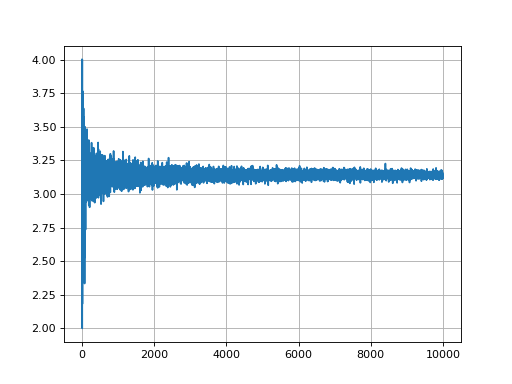

# Estimating Pi using the Monte Carlo Method
----

Simulating random numbers to estimate the value of pi

Presicion of value as the number of trials increases

---

You can see more projects at [here](http://ajumpa.com/)

